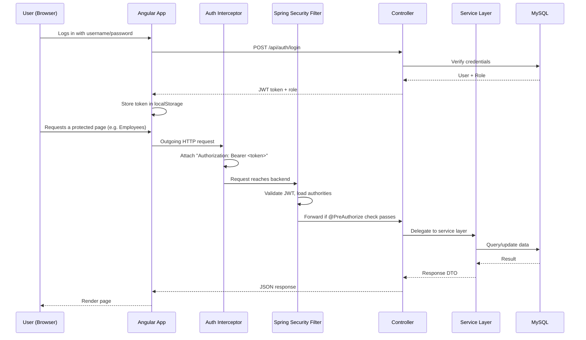
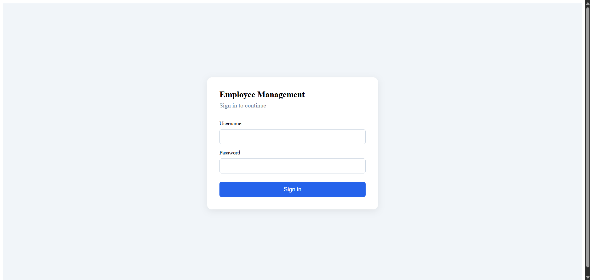
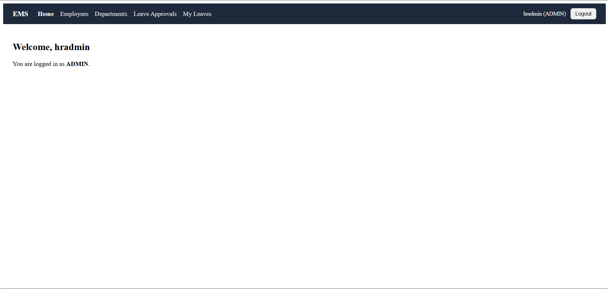
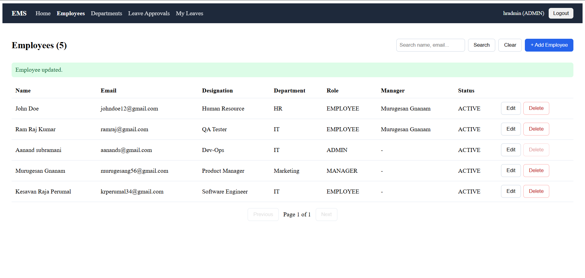
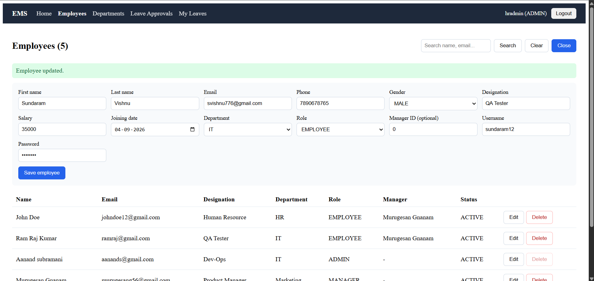
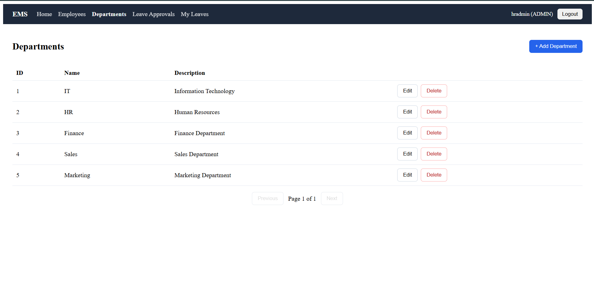
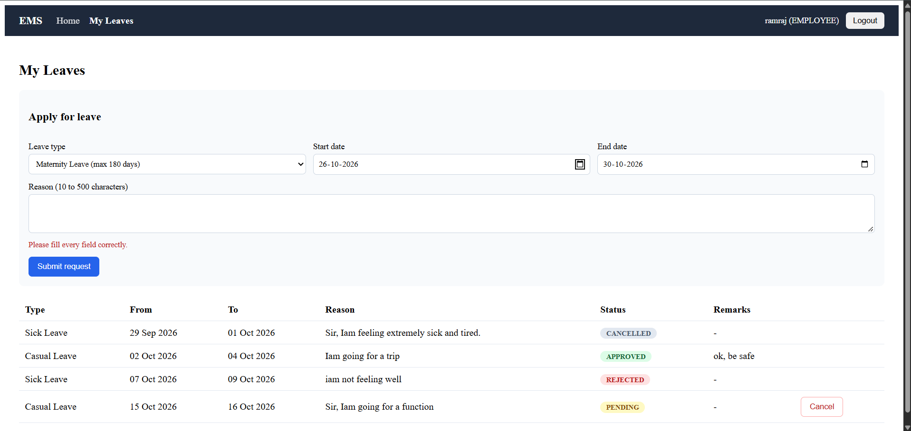
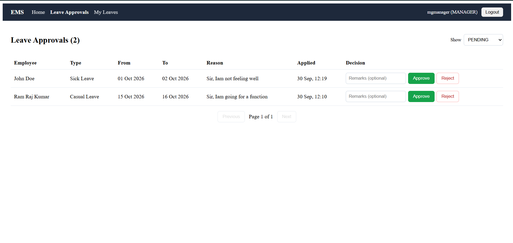

# Employee Management System

A full-stack Employee & Leave Management System built with Spring Boot, Angular, and MySQL, featuring JWT authentication and role-based access control (Admin, Manager, Employee).

---

## Table of Contents

- [Features](#features)
- [Tech Stack](#tech-stack)
- [Architecture](#architecture)
- [Screenshots](#screenshots)
- [Getting Started](#getting-started)
- [API Overview](#api-overview)
- [Security Design](#security-design)
- [Known Limitations](#known-limitations)
- [What I'd Improve With More Time](#what-id-improve-with-more-time)
- [Author](#author)

---

## Features

- **Authentication & Authorization** — JWT-based login; role-based route and endpoint protection via `@PreAuthorize`; the logged-in user's identity is derived from the JWT on every request rather than trusted from client-supplied input.
- **Employee Management** — Create, edit, search, paginate, and soft-delete employees (Admin only).
- **Department Management** — Full CRUD for departments, with a safety check that blocks deleting a department that still has active employees assigned to it.
- **Leave Management** — Employees apply for leave with overlap detection and date validation, view their own leave history, and cancel pending requests.
- **Leave Approval Workflow** — Managers approve or reject requests only from their own direct reports; Admins can act on any request. Self-approval is explicitly blocked at the service layer, not just hidden in the UI.
- **Role-based Angular UI** — Navigation and routes adapt to the logged-in user's role via route guards; an HTTP interceptor attaches the JWT to every outgoing request automatically.

---

## Tech Stack

**Backend:** Java, Spring Boot, Spring Security, Spring Data JPA, MySQL, JWT (jjwt), Maven
**Frontend:** Angular (standalone components, signals, reactive forms), TypeScript

---

## Architecture

```
employee-management-system/
├── backend/                # Spring Boot REST API
│   └── src/main/java/.../employee_management_system/
│       ├── controller/      # REST endpoints, @PreAuthorize role checks
│       ├── service/         # Business logic interfaces
│       ├── service/impl/    # Business logic implementation
│       ├── repository/      # Spring Data JPA repositories
│       ├── entity/          # JPA entities
│       ├── dto/             # Request/response contracts, separate from entities
│       ├── security/        # JWT filter, JwtService, SecurityUtils (current-user resolution)
│       ├── exception/       # Custom exceptions + GlobalExceptionHandler
│       └── config/          # SecurityConfig, CORS
└── frontend/                # Angular application
    └── src/app/
        ├── core/            # Auth service, HTTP interceptor, route guard, API service, models
        └── pages/           # login, dashboard, employees, departments, my-leaves, approvals
```


**Request flow:**



The backend follows a layered architecture: `controller → service → service.impl → repository`, with DTOs separating the API contract from JPA entities, dedicated mappers for entity-to-DTO conversion, and a global exception handler that returns consistent, correctly-coded error responses (400, 401, 403, 404, 500) instead of leaking stack traces.

---

## Screenshots

### Login


### Admin Dashboard


### Employee Management



### Department Management


### Apply for Leave


### Leave Approvals (Manager/Admin view)


---

## Getting Started

### Prerequisites
- Java 17+
- Maven
- MySQL 8+
- Node.js and Angular CLI

### Backend Setup

1. Create the database:
```sql
   CREATE DATABASE employee_management_db;
```

2. Set two environment variables (used by `application.properties` instead of hardcoded secrets):

DB_PASSWORD=<your MySQL password>
JWT_SECRET=<a random 256-bit+ secret>

   On Windows, this can be set permanently with:
```powershell
   setx DB_PASSWORD "your_password"
   setx JWT_SECRET "your_generated_secret"
```

3. Run the backend:
```powershell
   cd backend
   .\mvnw spring-boot:run
```

4. The API runs at `http://localhost:8080`. Swagger UI (for exploring/testing endpoints) is available at:

http://localhost:8080/swagger-ui/index.html


### Frontend Setup

```powershell
cd frontend
npm install
ng serve
```

The app runs at `http://localhost:4200`.

---

## API Overview

| Method | Endpoint                              | Access           | Description                          |
|--------|----------------------------------------|------------------|--------------------------------------|
| POST   | `/api/auth/login`                      | Public           | Authenticate, receive JWT            |
| GET    | `/api/employees`                       | Admin, Manager   | Paginated employee list              |
| GET    | `/api/employees/search`                | Admin, Manager   | Search employees by keyword          |
| POST   | `/api/employees`                       | Admin            | Create employee                      |
| PUT    | `/api/employees/{id}`                  | Admin            | Update employee details              |
| DELETE | `/api/employees/{id}`                  | Admin            | Soft-delete employee                 |
| GET/POST/PUT/DELETE | `/api/departments`         | Varies           | Department CRUD                      |
| POST   | `/api/leave-requests`                  | Any authenticated | Apply for leave (self only)         |
| GET    | `/api/leave-requests/my`               | Any authenticated | View own leave history              |
| PUT    | `/api/leave-requests/{id}/cancel`      | Any authenticated | Cancel own pending request          |
| GET    | `/api/leave-requests/status/{status}`  | Admin, Manager   | View requests by status (scoped)     |
| PUT    | `/api/leave-requests/{id}/approve`     | Admin, Manager   | Approve/reject (own reports only)    |

Full interactive documentation is available via Swagger UI once the backend is running.

---

## Security Design

A few decisions worth highlighting, since they came from fixing real gaps during development rather than being designed upfront:

- **Identity is derived from the JWT, not the request body.** Endpoints like "apply for leave" or "approve leave" originally accepted an `employeeId`/`approvedBy` field from the client — meaning any authenticated user could act *as* someone else by changing a number in the request. This was refactored so the backend always resolves the current user from the security context (`SecurityUtils.getCurrentEmployee()`).
- **Manager approvals are scoped, not just role-gated.** A Manager can only view and approve/reject leave requests from their own direct reports — this is enforced both in the list query and independently at the point of approval, so it can't be bypassed by calling the approve endpoint directly with a known ID.
- **Self-approval is blocked.** A Manager or Admin cannot approve their own leave request.
- **Consistent error responses.** A custom `GlobalExceptionHandler` ensures access-denied returns `403` (not a generic `500`), bad credentials return `401`, and validation failures return `400` with a clear message — rather than leaking a stack trace to the client.

---

## Known Limitations

- Attendance tracking is not implemented in this version; the project focuses on employee records and the leave workflow.
- Deleting a department is blocked while it still has active employees, but there is no UI flow yet for bulk-reassigning employees before deletion.

## What I'd Improve With More Time

- Add automated tests (this project currently relies on manual, role-by-role verification of each security rule via Swagger and the UI).
- Add filtering and column sorting to the Employees and Departments tables.
- Add email notifications on leave approval/rejection.

---

## Author

Yogeshwaran. C

[GitHub](https://github.com/yogesh-000) · [LinkedIn](https://www.linkedin.com/in/yogeshwaran-c/)

